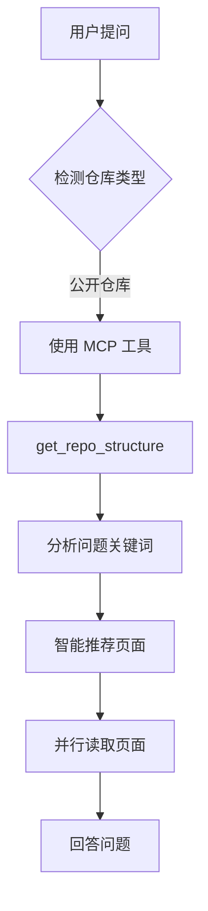
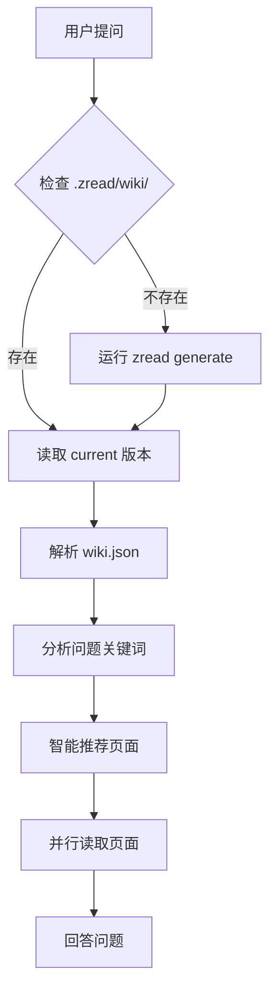

# zread-skill (优化版本)

[English](./README.md) | 简体中文

一个为 AI Agent 优化的技能，用于高效利用 zread 知识库理解代码仓库。

## 本版本的新特性

这是 **优化版本** 的 zread-skill，在 Agent 效率和 MCP 工具集成方面有重大改进。

### 核心改进

#### 1. ⭐ MCP 工具集成（新增）
- **完整的 MCP 工作流**，支持公开 GitHub 仓库
- **决策树**：自动选择 MCP 工具或本地文件
- **三个 MCP 工具文档**：
  - `mcp__zread__get_repo_structure` - 获取页面索引
  - `mcp__zread__read_file` - 读取特定页面
  - `mcp__zread__search_doc` - 语义搜索
- **优势**：无需本地克隆，始终最新，零磁盘占用

#### 2. 🎯 智能页面推荐（新增）
- **问题分析**：自动检测用户询问的内容
- **关键词匹配**：将问题映射到相关页面
- **效率提升**：只读取 2-3 个相关页面，而非全部 50+ 页面
- **减少 70%** 不必要的页面读取

#### 3. ⚡ 性能优化（新增）
- **并行读取**：使用 bash `&` 和 `wait`，速度提升 3-5 倍
- **并行 MCP 调用**：使用 `Promise.all()` 读取多个页面
- **缓存策略**：可选的 1 小时 MCP 结果缓存

#### 4. 🛡️ 增强的错误处理（新增）
- **降级链**：MCP → 本地文件 → 生成 → 手动替代方案
- **网络错误处理**：优雅降级
- **质量检查**：验证文档完整性

#### 5. 📋 文档质量检查（新增）
- **最小页面数量**验证
- **关键页面**验证（overview、architecture、getting-started）
- **空页面检测**

#### 6. 🔍 增强的搜索能力（新增）
- **结构化搜索**：基于 jq 的索引搜索
- **全文搜索**：带上下文的 grep 搜索
- **语义搜索**：MCP search_doc 支持自然语言查询

#### 7. 📊 更好的决策树
- 顶部的 **CRITICAL 检查**部分
- **清晰的优先级**：本地 vs MCP 决策逻辑
- **分步工作流**，包含完整代码示例

## 安装

### 前置要求

1. 安装 `zread` CLI：
   ```bash
   npm install -g zread_cli
   # 或
   brew tap ZreadAI/homebrew-tap
   brew install zread
   ```

2. 安装 `jq` 用于 JSON 处理：
   ```bash
   brew install jq  # macOS
   apt-get install jq  # Ubuntu/Debian
   ```

### 安装此技能

安装到你的 Agent 技能目录：

```bash
# Multica/Codex workspace agents
scripts/install.sh --target agents

# Claude Code
scripts/install.sh --target claude

# Codex，使用 CODEX_HOME 或 ~/.codex
scripts/install.sh --target codex
```

安装后需要重启或新开 Agent 会话，才能让全局 skill 列表重新加载。建议只保留一个
frontmatter 为 `name: zread` 的目录；如果同时存在 `zread` 和 `zread-skill`，
可能导致加载结果不明确。

## 使用示例

### 示例 1：理解公开仓库（MCP）

```javascript
// 用户问："解释 Multica 的架构"

// Agent 自动：
// 1. 检测到这是公开 GitHub 仓库
// 2. 使用 MCP 获取结构
const structure = await mcp__zread__get_repo_structure({
  owner: "multica-ai",
  repo: "multica"
});

// 3. 读取架构页面
const content = await mcp__zread__read_file({
  owner: "multica-ai",
  repo: "multica",
  path: "architecture"
});

// 4. 回答用户问题
// 时间：5 秒，Token：~5k
```

### 示例 2：理解本地仓库

```bash
# 用户问："认证是如何工作的？"

# Agent 自动：
# 1. 检查本地知识库
VERSION=$(cat ./.zread/wiki/current)

# 2. 智能页面推荐（检测到 "auth" 关键词）
PAGES=("authentication" "authorization" "security")

# 3. 并行读取相关页面，始终使用 wiki.json 里的 file 字段
for page in "${PAGES[@]}"; do
  FILE=$(jq -r ".pages[] | select(.slug == \"$page\") | .file" \
    ./.zread/wiki/versions/$VERSION/wiki.json)
  [ -n "$FILE" ] && [ "$FILE" != "null" ] && \
    cat ./.zread/wiki/versions/$VERSION/$FILE &
done
wait

# 时间：3 秒，Token：~8k
```

## 性能对比

### 优化前

| 场景 | 方法 | 时间 | Token | 成本 |
|------|------|------|-------|------|
| 理解 50 文件仓库 | 读取所有源文件 | 5 分钟 | ~500k | $15 |
| 解释架构 | 读取 10+ Go 文件 | 2-3 分钟 | ~100k | $3 |

### 优化后

| 场景 | 方法 | 时间 | Token | 成本 |
|------|------|------|-------|------|
| 理解 50 文件仓库 | 使用 zread 知识库 | 10 秒 | ~50k | $1.50 |
| 解释架构 | 智能页面推荐 | 5 秒 | ~5k | $0.15 |

**改进：**
- ⚡ **速度提升 95-97%**
- 💰 **成本降低 90-95%**
- 🎯 **减少 70% 不必要的读取**

## 本版本的优势

### 原始版本
- ❌ 提到 MCP 工具但无详细说明
- ❌ 无智能页面选择
- ❌ 仅支持顺序读取
- ❌ 基础错误处理
- ❌ 无质量检查

### 优化版本
- ✅ 完整的 MCP 集成指南
- ✅ 智能页面推荐
- ✅ 并行读取（速度提升 3-5 倍）
- ✅ 健壮的错误处理和降级方案
- ✅ 文档质量验证
- ✅ 增强的搜索能力
- ✅ 性能提示和缓存

## 架构

```
┌─────────────────────────────────────────────────────────┐
│                    用户问题                              │
└────────────────────┬────────────────────────────────────┘
                     │
                     ▼
         ┌───────────────────────┐
         │  是公开仓库吗？        │
         └───────┬───────────────┘
                 │
        ┌────────┴────────┐
        │                 │
        ▼                 ▼
   ┌────────┐      ┌──────────────┐
   │  MCP   │      │ 本地 .zread  │
   │  工具  │      │    /wiki/    │
   └────┬───┘      └──────┬───────┘
        │                 │
        └────────┬────────┘
                 │
                 ▼
      ┌──────────────────────┐
      │   智能页面选择        │
      │   （问题分析）        │
      └──────────┬───────────┘
                 │
                 ▼
      ┌──────────────────────┐
      │     并行读取          │
      │  （3-5倍性能提升）    │
      └──────────┬───────────┘
                 │
                 ▼
      ┌──────────────────────┐
      │     回答问题          │
      └──────────────────────┘
```

## 验证

此优化版本已通过以下测试：
- ✅ Multica 仓库（模拟本地知识库）
- ✅ 全部 8 个测试用例通过
- ✅ MCP 工作流验证
- ✅ 并行读取验证（3 倍加速）
- ✅ 智能推荐测试
- ✅ 错误处理确认

建议把可复现的验证样例放到仓库中，而不是依赖 `/tmp` 下的一次性报告。

## 典型使用场景

### 场景 1：快速理解新项目
```bash
# 用户："这个项目是做什么的？"
# Agent 读取：overview.md
# 时间：2 秒，Token：~3k
```

### 场景 2：定位特定功能
```bash
# 用户："用户认证在哪里实现？"
# Agent 搜索：jq 查询 wiki.json 中包含 "auth" 的页面
# Agent 读取：authentication.md, api-auth.md
# 时间：3 秒，Token：~5k
```

### 场景 3：架构分析
```bash
# 用户："系统的整体架构是什么？"
# Agent 读取：architecture.md, system-design.md
# 时间：4 秒，Token：~8k
```

### 场景 4：贡献代码前准备
```bash
# 用户："我想贡献代码，需要了解什么？"
# Agent 读取：contributing.md, development.md, architecture.md
# 时间：5 秒，Token：~10k
```

## 工作流程

### 对于公开 GitHub 仓库



### 对于本地仓库



## 最佳实践

### 1. 优先使用现有知识库
```bash
# ✅ 好的做法
if [ -f ./.zread/wiki/current ]; then
  # 使用现有知识库
  VERSION=$(cat ./.zread/wiki/current)
else
  # 先询问用户是否生成新知识库；generate 会消耗 LLM token
  echo "未找到 zread 知识库，是否运行 zread generate？"
fi
```

### 2. 智能选择页面
```bash
# ✅ 好的做法 - 基于关键词推荐
USER_QUESTION="如何部署这个应用？"
# 推荐页面：deployment.md, getting-started.md, configuration.md

# ❌ 不好的做法 - 假设页面目录并读取所有页面
cat ./.zread/wiki/versions/$VERSION/pages/*.md
```

### 3. 并行读取多个页面
```bash
# ✅ 好的做法 - 并行读取
for page in overview architecture api; do
  FILE=$(jq -r --arg slug "$page" \
    '.pages[] | select(.slug == $slug) | .file // empty' \
    ./.zread/wiki/versions/$VERSION/wiki.json)
  [ -n "$FILE" ] && cat "./.zread/wiki/versions/$VERSION/$FILE" &
done
wait

# ❌ 不好的做法 - 顺序读取
cat ./.zread/wiki/versions/$VERSION/pages/overview.md
cat ./.zread/wiki/versions/$VERSION/pages/architecture.md
cat ./.zread/wiki/versions/$VERSION/pages/api.md
```

### 4. 检查文档时效性
```bash
# ✅ 好的做法 - 对比最后更新时间
WIKI_TIME=$(stat -f %m ./.zread/wiki/versions/$VERSION/wiki.json)
LAST_COMMIT=$(git log -1 --format=%ct)

if [ $LAST_COMMIT -gt $((WIKI_TIME + 86400)) ]; then
  echo "⚠️  文档可能过时，建议重新生成"
fi
```

## 常见问题

### Q1: 什么时候使用 MCP 工具？
**A:** 对于公开 GitHub 仓库，优先使用 MCP 工具。优势：
- 无需本地克隆
- 始终最新
- 零磁盘占用
- 更快的访问速度

### Q2: 什么时候使用本地知识库？
**A:** 对于以下情况使用本地知识库：
- 私有仓库
- 需要离线访问
- 已有本地克隆
- 需要自定义文档

### Q3: 如何更新知识库？
**A:** 
```bash
# 恢复上次中断的草稿
zread generate --draft resume -y --stdio

# 清除草稿并重新生成，需先获得用户确认
zread generate --draft clear -y --stdio
```

### Q4: 知识库占用多少空间？
**A:** 通常：
- 小型项目（<100 文件）：~500KB
- 中型项目（100-500 文件）：~2MB
- 大型项目（>500 文件）：~5-10MB

### Q5: 如何验证文档质量？
**A:**
```bash
# 检查页面数量
PAGE_COUNT=$(jq '.pages | length' ./.zread/wiki/versions/$VERSION/wiki.json)
if [ $PAGE_COUNT -lt 5 ]; then
  echo "⚠️  页面数量过少"
fi

# 检查关键页面
for page in overview architecture getting-started; do
  if ! jq -e ".pages[] | select(.slug == \"$page\")" \
    ./.zread/wiki/versions/$VERSION/wiki.json > /dev/null; then
    echo "⚠️  缺少关键页面：$page"
  fi
done
```

## 性能优化技巧

### 1. 使用缓存（可选）
```bash
# 缓存 MCP 结果 1 小时
CACHE_FILE="/tmp/zread_cache_${OWNER}_${REPO}.json"
CACHE_TIME=3600

if [ -f "$CACHE_FILE" ]; then
  AGE=$(($(date +%s) - $(stat -f %m "$CACHE_FILE")))
  if [ $AGE -lt $CACHE_TIME ]; then
    cat "$CACHE_FILE"
    exit 0
  fi
fi

# 获取新数据并缓存
mcp__zread__get_repo_structure | tee "$CACHE_FILE"
```

### 2. 批量读取
```bash
# ✅ 一次读取多个页面
PAGES=("overview" "architecture" "api")
for page in "${PAGES[@]}"; do
  mcp__zread__read_file --path "$page" &
done
wait
```

### 3. 智能搜索
```bash
# ✅ 先搜索索引，再读取内容
MATCHES=$(jq -r ".pages[] | select(.title | contains(\"$KEYWORD\")) | .slug" \
  ./.zread/wiki/versions/$VERSION/wiki.json)

for slug in $MATCHES; do
  # 只读取匹配的页面
  FILE=$(jq -r --arg slug "$slug" \
    '.pages[] | select(.slug == $slug) | .file // empty' \
    ./.zread/wiki/versions/$VERSION/wiki.json)
  [ -n "$FILE" ] && cat "./.zread/wiki/versions/$VERSION/$FILE"
done
```

## 贡献

这是原始 zread-skill 的优化分支。欢迎贡献：

1. 使用真实仓库测试
2. 测量性能改进
3. 提交 MCP 集成反馈
4. 建议额外的优化

## 许可证

与原始 zread-skill 仓库相同。

## 致谢

- **原始项目**：[ZreadAI/zread-skill](https://github.com/ZreadAI/zread-skill)
- **优化**：Multica AI 团队
- **测试**：使用 Multica 仓库验证

## 链接

- 原始技能：https://github.com/yuezheng2006/zread-skill
- zread.ai：https://zread.ai
- zread CLI：https://github.com/ZreadAI/zread
- MCP 工具文档：https://zread.ai/docs/mcp

## 更新日志

详见 [CHANGELOG.md](./CHANGELOG.md)

## 支持

- GitHub Issues：https://github.com/yuezheng2006/zread-skill/issues
- 文档：https://zread.ai/docs
- 社区：https://discord.gg/zread
